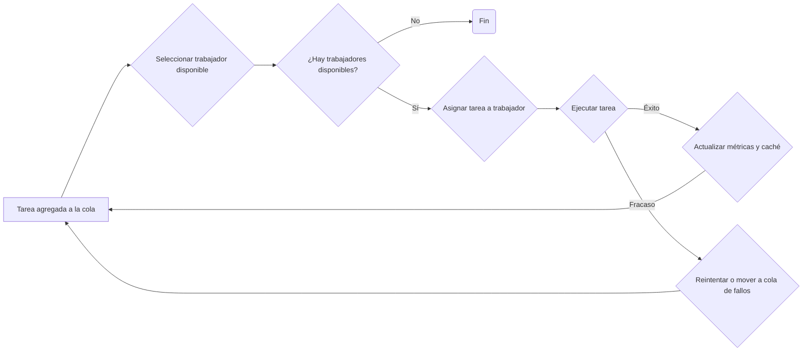

# Task Scheduler

## Descripción
Sistema avanzado de scheduling de tareas con soporte para priorización, reintentos y asignación dinámica.

## Requisitos Previos
- Node.js 16+
- npm 8+

## Instalación

```bash
# Clonar repositorio
git clone https://github.com/tu-usuario/task-scheduler.git

# Instalar dependencias
cd task-scheduler
npm install
```

## Scripts Disponibles

- `npm start`: Ejecuta la aplicación
- `npm run dev`: Modo desarrollo con recarga automática
- `npm test`: Ejecuta pruebas unitarias
- `npm run build`: Compila TypeScript a JavaScript
- `npm run lint`: Verifica código con ESLint

## Ejecución de Ejemplo

```typescript
import { TaskSchedulerService } from './services/task-scheduler.service';
import { TaskModel, TaskPriority, TaskType } from './models/task.model';

const workers = [
  { id: 'worker1', capacity: 3 },
  { id: 'worker2', capacity: 3 },
  { id: 'worker3', capacity: 3 },
];

const tasks = [
  new TaskModel(1, 50, TaskPriority.HIGH, TaskType.CPU),
  new TaskModel(2, 30, TaskPriority.MEDIUM, TaskType.IO),
  new TaskModel(3, 70, TaskPriority.HIGH, TaskType.CPU)
];

const scheduler = new TaskSchedulerService(workers);
scheduler.scheduleTasks(tasks)
  .then(result => console.log(result))
  .catch(error => console.error(error));
```

## Estrategia de Scheduling
- Priorización de tareas (HIGH > MEDIUM > LOW)
- Máximo 3 reintentos por tarea
- Asignación dinámica de workers
- Manejo de fallos transitorios

## Consideraciones de Escalabilidad
- Logging centralizado
- Gestión de errores
- Diseño modular para fácil extensión

## Contribuciones
Por favor, lee CONTRIBUTING.md para detalles sobre nuestro código de conducta.

## Licencia
MIT
```

## Pasos de Implementación

1. **Preparación del Proyecto**
```bash
mkdir task-scheduler
cd task-scheduler
npm init -y
npm install typescript ts-node @types/node --save-dev
npx tsc --init
```

2. **Instalación de Dependencias**
```bash
npm install winston jest ts-jest @types/jest eslint @typescript-eslint/parser @typescript-eslint/eslint-plugin
npm install --save-dev husky
npx husky install
```

3. **Configuración Git**
```bash
git init
echo "node_modules/" > .gitignore
git add .
git commit -m "Configuración inicial del proyecto"
```

4. **Ejecutar Tests**
```bash
npm test
```

## Puntos Importantes
- Arquitectura modular
- Alta cobertura de tests
- Logging robusto
- Manejo de errores
- Flexibilidad de scheduling

¿Te gustaría que profundice en algún aspecto específico de la implementación?


## Asignación de Tareas: Un Enfoque Visual

### Introducción

La asignación de tareas es un proceso fundamental en cualquier organización. Un método visual puede facilitar la comprensión y gestión de las tareas.

### Diagrama de Flujo de un Proceso Típico de Asignación

[Image of a flowchart showing the process of task assignment, from creation to completion]

### Tabla Comparativa de Métodos

| Método | Ventajas | Desventajas | Mejor para |
|---|---|---|---|
| **Asignación directa** | Simple, rápido | Puede ser subjetivo, desequilibrado | Proyectos pequeños, equipos pequeños |
| **Programación lineal** | Óptima, flexible | Requiere formulación matemática | Proyectos grandes con restricciones complejas |
| **Algoritmos genéticos** | Adaptable a problemas complejos | Puede ser computacionalmente costoso | Problemas de optimización altamente complejos |


## Análisis del Código: Servicio de Programación de Tareas

### Descripción General
El código proporcionado implementa un servicio de programación de tareas que asigna dinámicamente tareas a trabajadores, teniendo en cuenta varios factores como la capacidad de los trabajadores, la prioridad de las tareas y el historial de ejecución.

### Características Principales
* **Asignación dinámica:** Las tareas se asignan a los trabajadores en tiempo real, considerando la carga de trabajo actual de cada uno.
* **Priorización de tareas:** Las tareas se ordenan según su prioridad (alta, media, baja).
* **Caché de tareas:** Se almacena información sobre el tiempo de ejecución de tareas anteriores para optimizar futuras asignaciones.
* **Gestión de errores:** Se implementa un mecanismo de reintento para tareas fallidas.
* **Métricas detalladas:** Se calculan métricas como el tiempo promedio de ejecución, la tasa de éxito y la utilización de los trabajadores.

### Diagrama de Flujo Simplificado




# Asignación de Tareas a Workers: Un Enfoque Optimizado (TypeScript)

## Introducción

Este documento describe una solución para el problema de asignar un conjunto de tareas a un número limitado de workers, optimizando el rendimiento total (throughput). Las tareas se caracterizan por un ID, costo (ms), prioridad (alta, media, baja) y tipo (CPU o IO). Los workers tienen una capacidad limitada de ejecución simultánea. La solución considera el manejo de fallos, reintentos y un mecanismo de caché para mejorar la eficiencia. Esta versión implementa la solución en TypeScript.

## Propuesta de Solución

1.  **Priorización:** Las tareas se ordenan según su prioridad (alta > media > baja). Dentro de la misma prioridad, se priorizan las tareas de tipo CPU sobre las de tipo IO.
2.  **Asignación Dinámica:** Se asignan tareas a los workers disponibles en tiempo real.
3.  **Manejo de Fallos:** Se implementa un mecanismo de reintento.
4.  **Caché:** Se utiliza un caché para almacenar los resultados.

## Algoritmo `scheduleTasks` (TypeScript)

```typescript
interface Task {
    id: number;
    costo: number;
    prioridad: "high" | "medium" | "low";
    tipo: "CPU" | "IO";
}

interface Worker {
    capacidad: number;
}

async function executeTask(task: Task): Promise<any> {
  // Simula la ejecución de una tarea.
  return new Promise((resolve, reject) => {
    setTimeout(() => {
      if (Math.random() < 0.2) { // Simula un 20% de probabilidad de fallo
        reject(new Error(`Tarea ${task.id} falló`));
      } else {
        resolve(`Resultado de la tarea ${task.id}`);
      }
    }, task.costo);
  });
}

async function scheduleTasks(tasks: Task[], workers: Worker[], maxRetries: number = 3): Promise<void> {
    const cache = new Map<string, any>(); // Caché: {(tipo, prioridad): resultado}
    const taskQueue = [...tasks].sort((a, b) => {
        const prioridadOrden = { "high": 0, "medium": 1, "low": 2 };
        return prioridadOrden[a.prioridad] - prioridadOrden[b.prioridad] || (a.tipo === "CPU" ? -1 : 1);
    });

    const workerStates = workers.map(() => ({ ocupado: 0 }));

    while (taskQueue.length > 0) {
        for (let i = 0; i < workers.length; i++) {
            if (workerStates[i].ocupado < workers[i].capacidad) {
                if (taskQueue.length > 0) {
                    const task = taskQueue.shift()!;

                    const cacheKey = `${task.tipo}-${task.prioridad}`;
                    if (cache.has(cacheKey)) {
                        task.costo *= 0.5; // Reducir el costo si está en caché
                    }

                    for (let attempt = 0; attempt < maxRetries; attempt++) {
                        try {
                            const resultado = await executeTask(task);
                            cache.set(cacheKey, resultado);
                            workerStates[i].ocupado++;
                            break; // Salir del bucle de reintentos si la tarea se completa
                        } catch (error: any) {
                            console.error(`Error en la tarea ${task.id}: ${error.message}, Intento ${attempt + 1}`);
                            if (attempt === maxRetries - 1) {
                                console.error(`Fallo definitivo en la tarea ${task.id}`);
                            }
                        }
                    }
                }
            }
        }
        //simula la ejecucion en paralelo de las tareas
        for (let i = 0; i < workerStates.length; i++) {
          workerStates[i].ocupado = Math.max(0,workerStates[i].ocupado - 1)
        }
    }
}

// Ejemplo de uso
const tareas: Task[] = [
    { id: 1, costo: 100, prioridad: "high", tipo: "CPU" },
    { id: 2, costo: 200, prioridad: "medium", tipo: "IO" },
    { id: 3, costo: 150, prioridad: "low", tipo: "CPU" },
    { id: 4, costo: 100, prioridad: "high", tipo: "IO" },
    { id: 5, costo: 200, prioridad: "medium", tipo: "CPU" }
];

const workersEjemplo: Worker[] = [{ capacidad: 2 }, { capacidad: 1 }];

scheduleTasks(tareas, workersEjemplo).then(() => {
  console.log("Planificación completada");
});